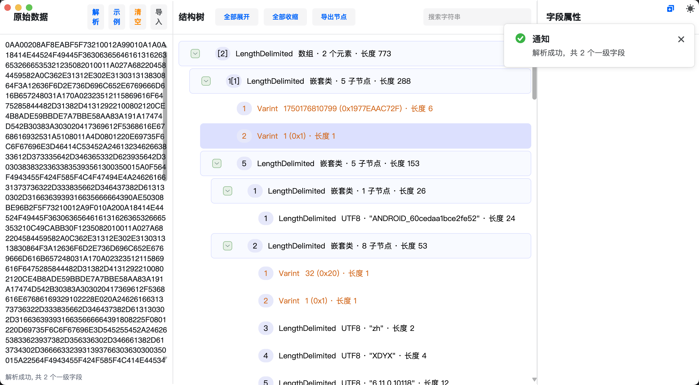

# Avalonia.ProtoParse

A modern, cross-platform Protocol Buffers (Protobuf) binary data parser and visualizer built with [Avalonia UI](https://avaloniaui.net/).

---

## 🇬🇧 English

**Avalonia.ProtoParse** is a handy tool designed for developers to inspect and decode arbitrary Protobuf binary data without needing the original `.proto` definition files. It parses the binary stream and reconstructs the field hierarchy based on Wire Types.

### ✨ Key Features

*   **Schema-less Parsing**: Decodes standard Protobuf binary formats without `.proto` files.
*   **Smart Input Recognition**: Automatically detects and handles multiple input formats:
    *   **Hex Strings** (with or without spaces)
    *   **Base64** (Standard & URL-Safe)
    *   **Gzip Compressed Data** (Auto-detect and decompress)
*   **Rich Visualization**: Displays data in a hierarchical TreeGrid with columns for Field ID, Wire Type, and Value Summary.
*   **Deep Inspection**: View detailed properties (Path, Raw Hex, UTF-8 preview, numeric values) in the side panel.
*   **Search**: Filter nodes by field ID, value content, or text preview.
*   **Theme Support**: Seamlessly adapts to Light and Dark system themes with a polished UI.

### 🚀 Getting Started

1.  Clone the repository.
2.  Open `Avalonia.ProtoParse.sln` in your IDE (Visual Studio, Rider, VS Code).
3.  Build and run the `Avalonia.ProtoParse.Desktop` project.
4.  Paste your Hex/Base64 string into the left panel and click **Parse** (or check the **Example**).

---

## 🇨🇳 中文介绍

**Avalonia.ProtoParse** 是一个基于 Avalonia UI 构建的跨平台 Protobuf 二进制数据解析与可视化工具。它专为开发者设计，允许在没有 `.proto` 定义文件的情况下，直接解析和检查 Protobuf 序列化数据。

### ✨ 核心功能

*   **无 Schema 解析**：无需 `.proto` 文件即可解析标准的 Protobuf 二进制结构，根据 Wire Type 重建数据层级。
*   **智能格式识别**：支持多种输入格式的自动检测与处理：
    *   **Hex 字符串**（支持包含空格、换行）
    *   **Base64**（支持标准格式及 URL-Safe 格式）
    *   **Gzip 压缩数据**（自动检测 Gzip 头并解压）
*   **结构化展示**：使用高性能 TreeGrid 展示数据层级，清晰呈现字段 ID、类型和摘要。
*   **详细属性面板**：在右侧面板查看选中节点的详细信息，包括完整路径、原始 Hex、UTF-8 文本预览、数值解码等。
*   **强大的搜索**：支持按 Field ID、内容或文本预览快速搜索和高亮匹配节点。
*   **主题适配**：完美支持 Light（浅色）和 Dark（深色）模式，界面美观现代。

### 🚀 使用说明

1.  克隆本仓库代码。
2.  使用 IDE (Visual Studio, Rider, VS Code) 打开 `Avalonia.ProtoParse.sln`。
3.  编译并运行 `Avalonia.ProtoParse.Desktop` 项目。
4.  在左侧输入框粘贴您的 Hex 或 Base64 字符串，点击 **解析** 按钮（或点击 **示例** 查看效果）。
5.  可以直接把文件拖入解析
